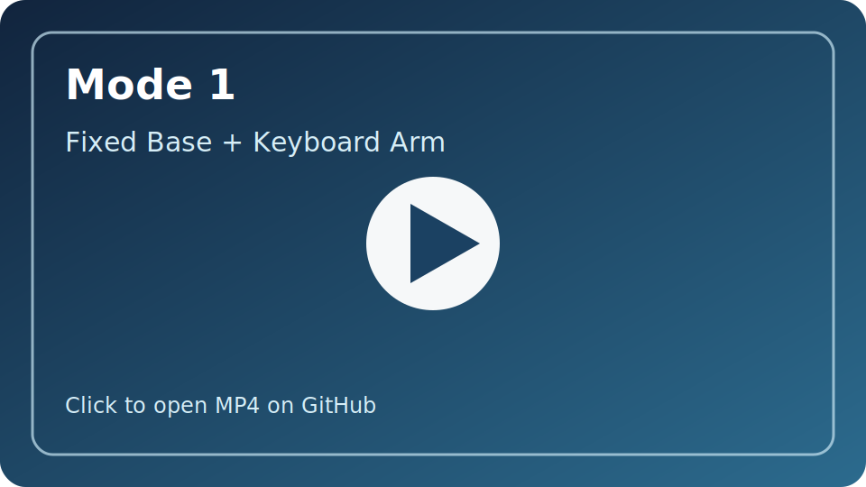
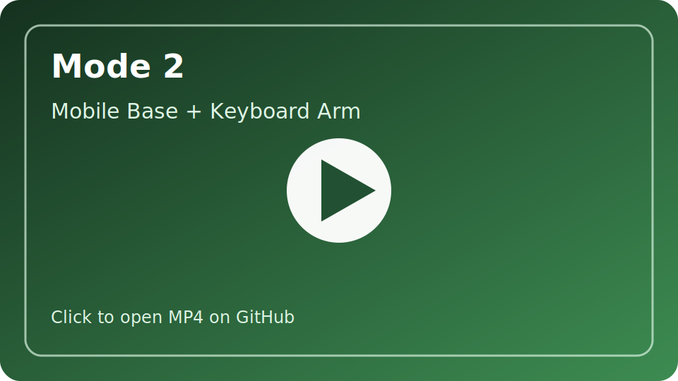
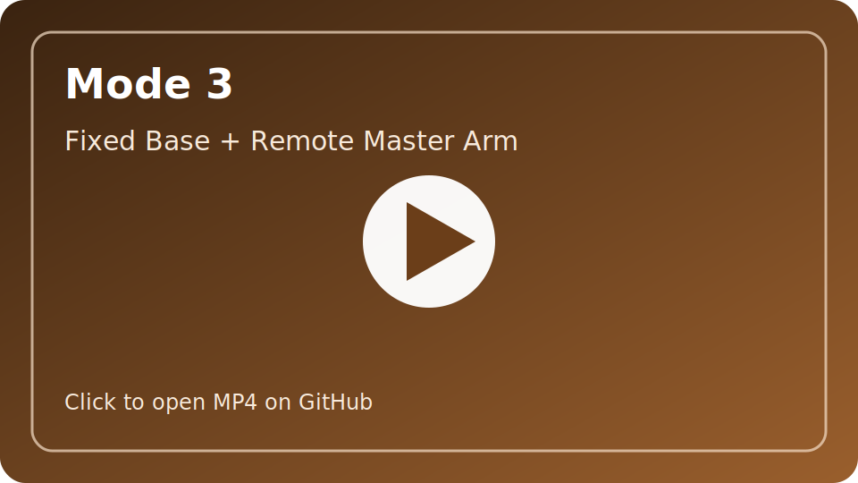
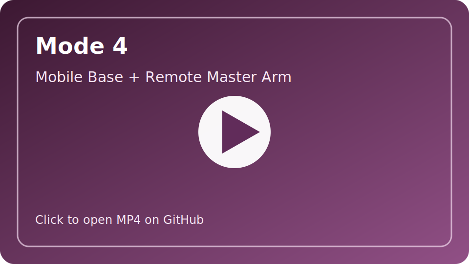

# Koch Mimic

这个仓库现在按 `cloud / local / shared` 三层重构成了一个可安装的 IsaacLab 外部项目。

- `source/koch_mimic/koch_mimic/cloud`
  运行在云端 IsaacLab / Isaac Sim 环境里，负责任务注册、Mimic 环境、teleop 接收和录制脚本。
- `source/koch_mimic/koch_mimic/local`
  运行在本地 leader arm 电脑上，负责串口读取、Dynamixel 调试和 SSH 推流。
- `source/koch_mimic/koch_mimic/shared`
  放两端共用的 YAML 配置加载、joint JSONL 协议和常量。

仓库不再要求放进 `IsaacLab/source` 内部，也不再依赖 `isaaclab_mimic.envs.my_custom_mimic_env...` 这类路径。

## 安装

云端 IsaacLab 环境：

```bash
pip install -e source/koch_mimic[cloud]
```

本地 leader arm 环境：

```bash
pip install -e source/koch_mimic[local]
```

## 配置

仓库提交的配置文件：

- `configs/cloud.defaults.yaml`
- `configs/cloud.user.example.yaml`
- `configs/local.defaults.yaml`
- `configs/local.user.example.yaml`

本地未提交的私有配置文件：

- `configs/cloud.user.local.yaml`
- `configs/local.user.local.yaml`

这两个 `*.user.local.yaml` 已经加入根目录 `.gitignore`，不会上传仓库。

初始化方式：

```bash
cp configs/cloud.user.example.yaml configs/cloud.user.local.yaml
cp configs/local.user.example.yaml configs/local.user.local.yaml
```

运行时加载顺序：

1. `defaults`
2. `user.local`
3. `--config <yaml>` 额外覆盖
4. 显式 CLI 参数覆盖

如果缺少 `user.local.yaml`，脚本会提示从 `user.example.yaml` 复制。

## Cloud

云端主任务 ID：

- 主 ID: `Isaac-Koch-Mimic-PickPlace-v0`
- 兼容别名: `Isaac-Koch-Pick-Place-IK-Rel-Mimic-v0`

录制示教：

```bash
./isaaclab.sh -p /abs/path/to/repo/scripts/cloud/record_koch_mimic_demos.py --config /abs/path/to/repo/configs/cloud.user.local.yaml --task Isaac-Koch-Mimic-PickPlace-v0
```

运行 teleop：

```bash
./isaaclab.sh -p /abs/path/to/repo/scripts/cloud/run_koch_mimic_teleop.py --config /abs/path/to/repo/configs/cloud.user.local.yaml --task Isaac-Koch-Mimic-PickPlace-v0
```

说明：

- 云端脚本只是薄入口，真实逻辑都在已安装包 `koch_mimic` 里。
- 任务注册由 `koch_mimic.cloud.tasks.koch_pick_place` 包内完成。
- 不再需要把任何环境代码复制到 `external/IsaacLab/source/isaaclab_mimic/...`。

### 四种 Teleop 模式

切换维度：

- `--teleop_fixed_base` / `--no-teleop_fixed_base`
- `--arm_teleop_source keyboard` / `--arm_teleop_source remote_master_arm`

四种模式一览：

| 模式 | 底盘 | 手臂控制源 | 内部 device name | 录制命令 | 效果视频 |
| --- | --- | --- | --- | --- | --- |
| Mode 1 | Fixed | Keyboard | `keyboard` | 见下方命令 1 | [也可见下方视频](docs/media/videos/Mode1.mp4) |
| Mode 2 | Mobile | Keyboard | `keyboard_mecanum` | 见下方命令 2 | [也可见下方视频](docs/media/videos/Mode2.mp4) |
| Mode 3 | Fixed | Remote Master Arm | `external_master_arm` | 见下方命令 3 | [也可见下方视频](docs/media/videos/Mode3.mp4) |
| Mode 4 | Mobile | Remote Master Arm | `external_master_arm_mecanum` | 见下方命令 4 | [也可见下方视频](docs/media/videos/Mode4.mp4) |

### 效果视频

GitHub 仓库 README 不稳定支持内嵌 mp4 播放，可在[仓库内](docs/media/videos)下载视频文件或右键视频复制链接到新标签页打开。

#### Mode 1: Fixed Base + Keyboard Arm

[](https://github.com/user-attachments/assets/79490d78-5274-4205-91a6-4af35ee0e04f)

#### Mode 2: Mobile Base + Keyboard Arm

[](https://github.com/user-attachments/assets/735bbd1c-0710-4d0f-8b93-ab4ad5a14406)

#### Mode 3: Fixed Base + Remote Master Arm

[](https://github.com/user-attachments/assets/b69c1bc0-4e4c-4093-bdd0-1148e4e4abaa)

#### Mode 4: Mobile Base + Remote Master Arm

[](https://github.com/user-attachments/assets/a2497755-ddfa-422c-82af-fe3a9e748360)

录制脚本四种完整命令模板：

```bash
# 1. Fixed base + keyboard arm
./isaaclab.sh -p /abs/path/to/repo/scripts/cloud/record_koch_mimic_demos.py \
  --config /abs/path/to/repo/configs/cloud.user.local.yaml \
  --task Isaac-Koch-Mimic-PickPlace-v0 \
  --teleop_fixed_base \
  --arm_teleop_source keyboard
```

```bash
# 2. Mobile base + keyboard arm
./isaaclab.sh -p /abs/path/to/repo/scripts/cloud/record_koch_mimic_demos.py \
  --config /abs/path/to/repo/configs/cloud.user.local.yaml \
  --task Isaac-Koch-Mimic-PickPlace-v0 \
  --no-teleop_fixed_base \
  --arm_teleop_source keyboard
```

```bash
# 3. Fixed base + remote master arm
./isaaclab.sh -p /abs/path/to/repo/scripts/cloud/record_koch_mimic_demos.py \
  --config /abs/path/to/repo/configs/cloud.user.local.yaml \
  --task Isaac-Koch-Mimic-PickPlace-v0 \
  --teleop_fixed_base \
  --arm_teleop_source remote_master_arm
```

```bash
# 4. Mobile base + remote master arm
./isaaclab.sh -p /abs/path/to/repo/scripts/cloud/record_koch_mimic_demos.py \
  --config /abs/path/to/repo/configs/cloud.user.local.yaml \
  --task Isaac-Koch-Mimic-PickPlace-v0 \
  --no-teleop_fixed_base \
  --arm_teleop_source remote_master_arm
```

补充说明：

- `remote_master_arm` 的两种模式需要先在本地机器启动 `scripts/local/stream_koch_leader_over_ssh.py`
- `keyboard` 的两种模式不需要本地 leader arm 推流
- 如需将 `num_demos`、`dataset_file`、`stream-port` 等参数固定下来，优先写进 `configs/cloud.user.local.yaml`

## Local

本地入口都在 `scripts/local/`：

- `scripts/local/stream_koch_leader_over_ssh.py`
- `scripts/local/debug_koch_leader_bus.py`
- `scripts/local/test_koch_leader_serial.py`

本地 SSH 推流：

```bash
python /abs/path/to/repo/scripts/local/stream_koch_leader_over_ssh.py --config /abs/path/to/repo/configs/local.user.local.yaml
```

本地总线调试：

```bash
python /abs/path/to/repo/scripts/local/debug_koch_leader_bus.py --config /abs/path/to/repo/configs/local.user.local.yaml status
```

本地串口监视：

```bash
python /abs/path/to/repo/scripts/local/test_koch_leader_serial.py --config /abs/path/to/repo/configs/local.user.local.yaml
```

说明：

- `scripts/LeaderArmData2JSONL` 这部分职责已经迁到 `koch_mimic.local`。
- 本地脚本不依赖 IsaacLab，只需要本地串口、Dynamixel 和 SSH 相关依赖。

## 任意位置运行

验收目标是：

- 仓库可以放在任何路径。
- 只要环境已经 `pip install -e source/koch_mimic[...]`，就能从任意当前工作目录运行。
- 入口脚本只依赖已安装包和 YAML 配置，不依赖当前 shell 位于仓库根目录。

`external/IsaacLab` 现在只保留作参考/开发资源，不参与运行时路径解析。
